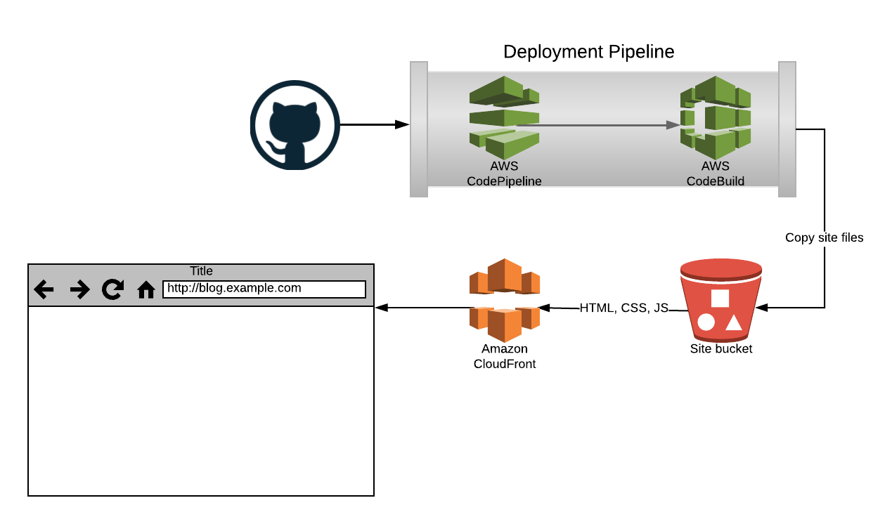

# aws-static-site
AWS CloudFormation templates for building a static website hosted on S3 and CloudFront. The project also includes a simple React website to demonstrate the deployment process.



## Setup 
To deploy the changes you need to create a certificate, deploy the site stack, and deploy the site to S3. We will use `blog.example.com` as our site name as an example.
### Create certificate
Create an ACM certificate in the AWS console for with names `*.example.com` and `example.com`. Use DNS validation and click on the create Route53 records buttons. Wait until the certificate is verified, copy the ARN, and use it as a parameter for the site stack.

### Create the site stack
The static-site.yml CloudFormation template creates the following AWS resources:
1. S3 bucket for the site assets
2. CloudFront distribution to support HTTPS

Example (update parameters to match your site):
```
aws cloudformation create-stack --stack-name blog-example-com-site --template-body file://cfn/static-site.yml --parameters ParameterKey=SiteDomainName,ParameterValue=blog.example.com ParameterKey=RootDomainName,ParameterValue=example.com ParameterKey=CertificateARN,ParameterValue=arn:aws:acm:us-east-1:111111111111:certificate/22222222-2222-222222222-222222222222
```

### Create the deployment pipeline 
The pipeline.yml CloudFormation template creates the follow AWS resources:
1. CodePipeline for deploying the site to S3
2. CodeBuild projects for building and deploying the site
3. IAM policies for both CodePipeline and CodeBuild
4. S3 bucket for hosting CodePipeline and CodeBuild artifacts

Example (update parameters to match your site):
```
aws cloudformation create-stack --stack-name blog-example-com-pipeline --template-body file://cfn/pipeline.yml --capabilities CAPABILITY_IAM --parameters ParameterKey=CloudFrontDistribution,ParameterValue=EEEEEEEEEEEEEE ParameterKey=Pipeline,ParameterValue=blog-example-com ParameterKey=GitHubOwner,ParameterValue=MyOwner ParameterKey=GitHubRepo,ParameterValue=MyRepo ParameterKey=GitHubToken,ParameterValue=MyToken
```

### Deploy the site
The CodePipeline will automatically deploy the site to S3 on every commit. The first deploy command syncs all of the files to S3, with the exception of the index.html. This ensures that all the CSS/JS files referenced in index.html exist in S3 before the index.html is deployed. This ensures that a request cannot get a new index.html before its dependencies exist on S3. The second deploy command copies the index.html and the third command invalidates the CloudFront cache so the new site is visible to clients.
```
aws s3 sync build/ s3://${SITE_BUCKET} --exclude index.html --cache-control max-age=31536000
aws s3 cp build/index.html s3://${SITE_BUCKET} --metadata-directive REPLACE --cache-control "max-age=60,s-maxage=31536000"
aws cloudfront create-invalidation --distribution-id ${CLOUDFRONT_DISTRIBUTION} --paths /index.html
```

The `s3 sync` command only copies new files to S3, it never removes existing files. By not removing existing files it prevents a race condition where a client may have received an old index.html that references the old CSS/JS files which are deleted from S3 by a new deployment. Because S3 is eventually consistent it is not safe to immediately delete these old CSS/JS files when the new index.html is deployed. 

### Caching
To increase the effeciency of the site, files are cached for as long as possible. The build process generates a unique hash for each file based on its contents. This allows for indefinite caching of files because the file name will change if the contents are changed. Both the browser and the CDN are instructed to cache these files are 1 year with the `Cache-Content: max-age=31536000` header. The index.html is different because it does not contain a unique hash. To update the index.html, the browser is instructed to cached the file for 1 minute and the CDN is instructed to cache the file for 1 year using the `Cache-Content: max-age=60,s-maxage=31536000` header. Each time the site is deployed the index.html is cleared from the CDN cache so that the browser will get the updated version quickly.
